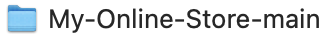

# My Online Store

## Description

My Online Store is a server that hosts an online store’s products, product categories, and product tags. My Online Store has API routes that can be used to retrieve, create, modify, and delete data, which allows a front end web application to connect to the server’s logic and data flawlessly. I created this project to visualize completely the main functionalities that a back end web application has to accomplish, since they are responsible for connecting the front end of the web application with the web application’s logic and database. With this project I can see how different npm libraries perform different functions. Express.js handles the API routes, Sequelize handles the database models, Dotenv the environmental variables, and Pg the database connection and queries. Overall this project was a great learning experience.

## Table of Contents

- [Installation](#installation)
- [Usage](#usage)
- [Credits](#credits)
- [License](#license)

## Installation

1. Before you download the My Online Store’s code, first you must have installed in your computer Node.js and PostgreSQL.

   - If you don’t have Node.js installed in your computer, you can click on the following link to download its installer: https://nodejs.org/en/download/prebuilt-installer

   - If you don’t have PostgreSQL installed in your computer, you can click on the following link to download its installer: https://www.postgresql.org/download/

2. To download the My Online Store’s code, all you have to do is to click on the green “Code” button found in the main branch of its GitHub repository, then select the “Download ZIP” option to download the code in a .zip folder.

3. Finally all you have to do is to extract the code, and open the project folder and rename the ".env.EXAMPLE" file to ".env", then open it and change the "DB_USER" enviromental variable's value to the user you created when you installed PostgreSQL, and the "DB_PASSWORD" enviromental variable's value to the password you created when you installed PostgreSQL as well.

4. To learn how to use the My Online Store, just check out the “Usage” section found down below.

## Usage

To learn how to use My Online Store, click on the following link to see its walkthrough video: https://drive.google.com/file/d/1KENGa8c_pZxKdLijEcYYLTQMojaeZ_G6/view?usp=sharing

## Credits

1. To learn about sequelize models:

   - Sequelize Contributors. (2024, June 20). Model basics. Model basics | Sequelize. https://sequelize.org/docs/v6/core-concepts/model-basics/

2. To learn about sequelize primary and foreign keys:

   - Sequelize Contributors. (2024, June 20). Working with legacy tables. Working with legacy tables | Sequelize. https://sequelize.org/docs/v6/other-topics/legacy/

3. To learn about sequelize model associations:

   - Sequelize Contributors. (2024, June 20). Associations. Associations | Sequelize. https://sequelize.org/docs/v6/core-concepts/assocs/

4. To learn about sequelize validation and constraints:

   - Sequelize Contributors. (2024, June 20). Validations & Constraints. Validations & Constraints | Sequelize. https://sequelize.org/docs/v6/core-concepts/validations-and-constraints/

## License

My Online Store is under the MIT license.
